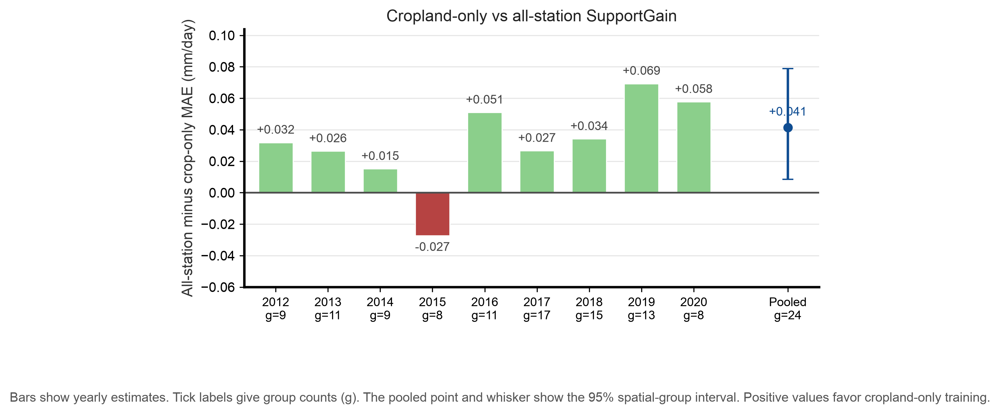

# Tier 1 cropland-only training result

This run follows the frozen [cropland training protocol](../../evaluation/ML_TIER1_CROPLAND_TRAINING_PROTOCOL.md). The protocol was committed before fitting in commit `a4f8032`. Its SHA-256 hash is `4e8544e452bcdb814f1b0d357555a8b9a069ade2894eb6ca25ea56fd3d930c84`.

## Population and method

The clean gridMET cohort has 5,203 Croplands rows from 58 stations and 30 groups. The rolling test set from 2012 through 2020 has 3,234 rows from 49 stations and 24 groups. Stations can occur in both training and test years. This tests temporal transfer within the land-cover group. It does not test transfer to unseen stations.

The all-station baseline uses the saved ten-member SupportGain predictions. SupportGain was selected before this analysis because it had the lowest fixed end-to-end MAE among seven Tier 3 selectors on clean all-station data. The crop-only arm restricts both neural training and selector fitting to Croplands rows. Both arms use the same test rows and OpenET fallback.
The earlier selector ranking used this archive and included the cropland test rows. The cropland comparison was fixed before its fit, but the method choice was data-informed.

The land-cover field does not identify irrigation. These results do not establish performance on irrigated fields.

## Primary result

The primary outcome is all-station SupportGain MAE minus cropland-only SupportGain MAE. A positive value favors crop-only training.

| Training arm | Station-macro MAE | Pooled MAE | Station-weighted acceptance |
| --- | ---: | ---: | ---: |
| All-station SupportGain | 0.8291 mm/day | 0.8333 mm/day | 64.1% |
| Cropland-only SupportGain | 0.7877 mm/day | 0.7941 mm/day | 57.4% |

The paired improvement is 0.0414 mm/day. Its 95% spatial-group bootstrap interval is 0.0085 to 0.0788 mm/day. The interval uses 2,000 draws over 24 groups and seed 20261005. The comparison uses 3,234 test rows from 49 stations. It conditions on fitted models and selectors.
The interval does not account for the earlier SupportGain choice.

Cropland-only SupportGain has lower station-macro MAE in eight of nine rolling test years. The years reuse stations and groups. Treat the yearly values as descriptive, not independent replications.



Figure 18 shows the annual point estimates. Positive values favor crop-only training. The pooled interval appears below the figure.

## Secondary results and limits

OpenET scores 0.8368 mm/day station-macro MAE on these test rows. All-station Full scores 0.8850 mm/day, while cropland-only Full scores 0.7770 mm/day.

An exploratory group bootstrap gives a 0.1080 mm/day Full-model advantage for crop-only training. Its 95% interval is 0.0388 to 0.2060 mm/day across 24 groups. It uses 2,000 draws with seed 20261006. The point estimates were reviewed before this interval was defined. Treat it as descriptive, not independent confirmation. The interval conditions on the fitted models. No p-value was calculated.

Cropland-only SupportGain scores 0.7877 mm/day. The frozen protocol names only this SupportGain contrast as primary. The Full comparison follows the [exploratory Full-model audit protocol](../../evaluation/ML_TIER1_CROPLAND_FULL_AUDIT.md).

The run fits 270 inner and 90 outer neural members. All 360 members reach the 120-iteration limit and report convergence warnings. The run takes 58.3 seconds. This is one measurement without a timing interval. It uses Python 3.13.5, NumPy 2.4.3, pandas 2.3.3, and scikit-learn 1.8.0.

The result supports crop-specific training on this fixed cohort. It does not establish a general benefit across independent datasets or irrigated croplands. The primary interval accounts for spatial groups. It omits retraining and method-selection uncertainty.

The figure adapts the typography, palette, clean axes, and vector-export approach in the [figures4papers repository](https://github.com/ChenLiu-1996/figures4papers). The repository provides a [publication figure workflow](https://github.com/ChenLiu-1996/figures4papers/blob/main/scientific-figure-making/SKILL.md).

## Files

- [Yearly and pooled performance summary](performance_summary.csv)
- [Primary paired comparison](primary_comparison.json)
- [Exploratory Full-model comparison](full_exploratory_comparison.json)
- [Analysis receipt](analysis_receipt.json)
- [Run receipt](run_receipt.json)
- [Saved test predictions](predictions_cropland_test.csv)
- [Figure receipt](figure_receipt.json)
- [Protocol](../../evaluation/ML_TIER1_CROPLAND_TRAINING_PROTOCOL.md)
- [Figure 18 PDF](../../../manuscript/arxiv/figures/figure_18_tier1_cropland_training.pdf)

Reproduce the run and its report with:

```sh
python3 scripts/run_ml_tier1_cropland.py
python3 scripts/analyze_ml_tier1_cropland.py
python3 scripts/build_ml_tier1_cropland_figure.py
```
