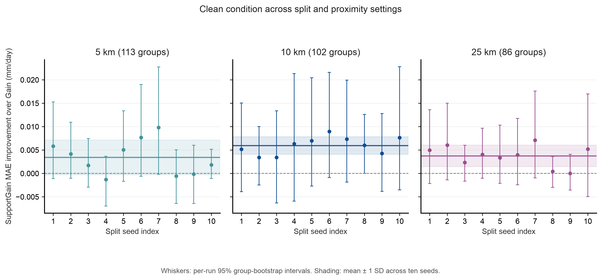

# Tier 1 split and proximity sensitivity

This analysis follows the frozen [sensitivity protocol](../../evaluation/ML_TIER1_GRIDMET_SPLIT_PROXIMITY_PROTOCOL.md). It varies inner spatial fold seeds and proximity thresholds. It keeps the cohort, model settings, and test years fixed.

## Evaluation

The full cohort has 16,366 rows from 151 stations. The 5, 10, and 25 km maps have 113, 102, and 86 proximity groups. Each threshold uses ten split seeds from 20260924 through 20261003.

The pooled test set has 7,842 rows from 101 stations. It has 71, 64, and 55 test groups at 5, 10, and 25 km. The test years run from 2012 through 2020. Stations can occur in both training and test years.

The primary outcome is `Gain MAE - SupportGain MAE`. Positive values favor SupportGain. Each run reports a paired 95% group-bootstrap interval from 2,000 draws. The seed summaries describe repeated splits on the same rows. They are not independent trials. The analysis uses no p-values across seeds.

## Clean condition

| Proximity threshold | Mean SupportGain improvement | SD across ten splits | Range | Positive estimates | Intervals above zero |
| --- | ---: | ---: | ---: | ---: | ---: |
| 5 km | 0.00341 mm/day | 0.00372 mm/day | -0.00128 to 0.00983 mm/day | 7 of 10 | 0 of 10 |
| 10 km | 0.00596 mm/day | 0.00187 mm/day | 0.00343 to 0.00898 mm/day | 10 of 10 | 1 of 10 |
| 25 km | 0.00376 mm/day | 0.00230 mm/day | 0.00002 to 0.00712 mm/day | 10 of 10 | 0 of 10 |

The pooled clean estimate across all 30 settings is 0.00438 mm/day. Its split-setting SD is 0.00289 mm/day. Twenty-nine of 30 paired bootstrap intervals include zero. The clean result does not show a stable, material SupportGain advantage.

## Synthetic weather faults

SupportGain has lower station-macro MAE than Gain in all 30 settings for each of the twelve synthetic transforms. The mean improvement under the temperature-plus-32 C transform is 0.55623 mm/day. Its SD across settings is 0.04753 mm/day, and its range is 0.44878 to 0.62684 mm/day.

These transforms do not represent twelve independent datasets. Their paired intervals are descriptive and are not adjusted across the 390 setting-condition summaries. They do not establish performance on observed sensor faults or unseen stations.

## Compute and limits

Recorded runtime totals 111.8 minutes across 29 new fits. No timing interval or baseline was measured. The existing 10 km, seed 20260924 run serves as the anchor. All 10,800 neural fits reach 120 iterations and report convergence warnings. These warnings may limit selector quality.

The [seed summary](seed_summary.csv) reports the mean, standard deviation, range, and interval counts for every condition. The [run contrasts](run_contrasts.csv) retain every threshold, seed, and condition. The [run manifest](run_manifest.json), receipts, compressed predictions, and [analysis receipt](analysis_receipt.json) bind the inputs and outputs.



Figure 16 shows per-run 95% group-bootstrap intervals. Shading shows one standard deviation across ten split settings.

Run the frozen pipeline with these commands:

```sh
python3 scripts/run_ml_tier1_gridmet_sensitivity.py
python3 scripts/analyze_ml_tier1_gridmet_sensitivity.py
python3 scripts/build_ml_tier1_gridmet_sensitivity_figure.py
```
