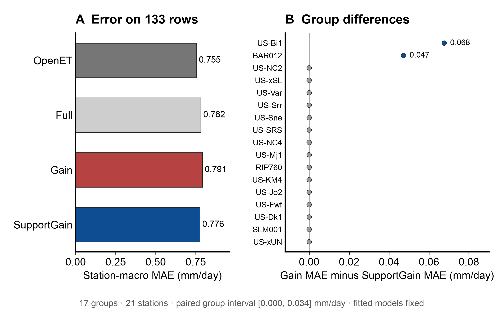

# Natural input violation extension

This exploratory run follows the [frozen protocol](../../evaluation/ML_TIER1_NATURAL_VIOLATIONS_PROTOCOL.md), committed as `843d7b0` before fitting.
The protocol SHA-256 is `931d4b0edd742d7e1c6aa599427a981b6ef74429db997aae19bc034e05eb16c8`.
The `manilacotton` outcome was known before this extension. The named contrast excludes that station.

## Population and replay

The fixed physical screen flags 165 complete-weather rows from 22 stations and 18 proximity groups.
After excluding 32 `manilacotton` rows, the analysis retains 133 rows from 21 stations and 17 groups.
A physical rule violation does not prove that an instrument failed.

The run refits the saved three-member method on the clean cohort in ten proximity folds.
It excludes every invalid row from training and selector fitting. It scores each invalid row in its held-out group.
The replay matches all 7,758 saved clean test rows and both acceptance masks.
The largest clean prediction difference is `8.88e-16` mm/day, below the fixed `1e-8` mm/day tolerance.

## Named contrast without the known station

| Method | Station-macro MAE | Station-weighted acceptance |
| --- | ---: | ---: |
| OpenET | 0.7546 mm/day | No correction |
| Full | 0.7821 mm/day | 100.0% |
| Gain | 0.7912 mm/day | 57.2% |
| SupportGain | 0.7761 mm/day | 55.2% |

Gain minus SupportGain station-macro MAE is **0.0151 mm/day**.
The paired 95% group-bootstrap interval is **[0.0000, 0.0336] mm/day**.
It uses 2,000 draws over 17 groups with seed `20260924`. It conditions on the fitted models and selectors.
The interval touches zero. Fifteen groups have exactly zero method difference.
Only `US-Bi1` and `BAR012` favor SupportGain, by 0.0676 and 0.0473 mm/day in their group station means.

OpenET has lower point error than both selectors on the 133 rows.
Its 0.7546 mm/day station-macro MAE is 0.0215 mm/day below SupportGain.
This OpenET comparison is descriptive and has no planned interval.



The figure shows the complete-system error and every group's paired difference.
It follows the [figures4papers publication workflow](https://github.com/ChenLiu-1996/figures4papers/blob/main/scientific-figure-making/SKILL.md).

## Other descriptive populations

Including `manilacotton` gives 165 rows from 22 stations and 18 groups.
Gain then scores 1.7862 mm/day and SupportGain scores 0.7906 mm/day station-macro MAE.
The large change from the named 133-row contrast reflects the known single-station failure.

The negative-vapor-pressure subset has 50 rows from six stations and six groups, including `manilacotton`.
Without that station, it has 18 rows from five stations and five groups.
On those 18 rows, Gain scores 0.7767 mm/day and SupportGain scores 0.7673 mm/day.
These are descriptive point estimates with no planned intervals.

The extension does not confirm a broad natural-fault advantage or an improved estimator over OpenET.
The source archive and known station were inspected before this protocol. The result is not independent replication.

## Records and reproduction

The [prediction file](predictions_invalid.csv) contains all 165 held-out rows.
The [group table](group_effects_other.csv), [summary](analysis_summary.json), [run receipt](run_receipt.json), and [analysis receipt](analysis_receipt.json) preserve the result.
The run receipt records source hashes, code hashes, library versions, seeds, warnings, and a 47.6-second fit replay.
This is one timing measurement without an interval.

Run the commands in a fresh checkout with the prior saved inputs:

```sh
python3 scripts/run_ml_tier1_natural_violations.py
python3 scripts/analyze_ml_tier1_natural_violations.py
python3 scripts/build_ml_tier1_natural_violations_figure.py
```

The runner refuses to overwrite completed results.
