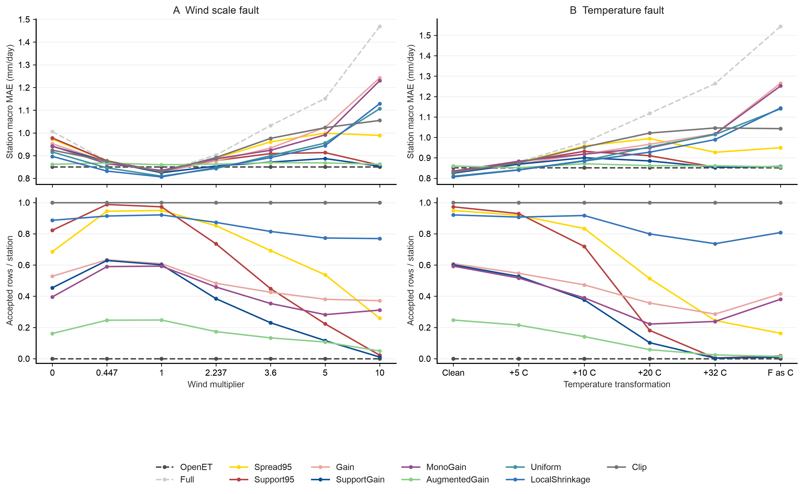
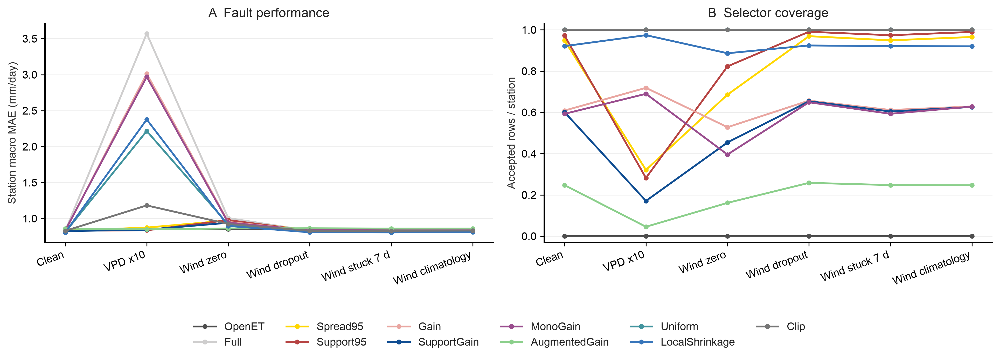
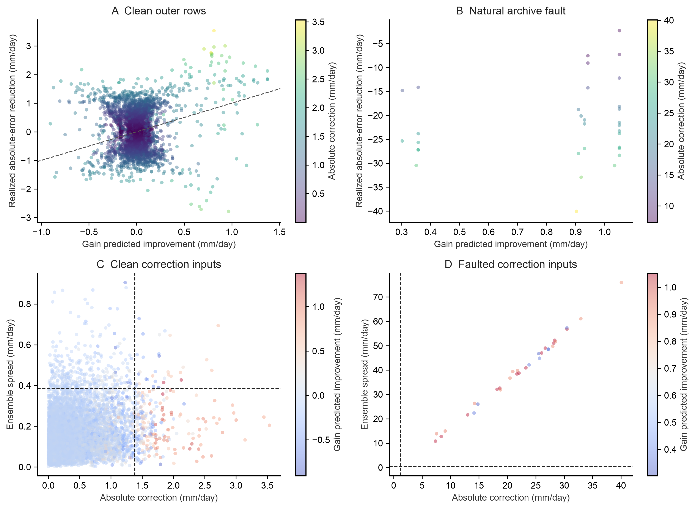

# Tier 1 measured-weather correction

Status: corrected implementation run. Treat all results as exploratory because
the original outcomes were inspected.

## Correction

The original run recomputed the residual correction for each transformed
input. It reused spread and support distance from clean inputs. The corrected
run recomputes all three outputs from each transformed input.

The run uses the same 7,758 test rows from 84 stations and 62 groups. It keeps
the original cohort, splits, model settings, fault transforms, and seeds. The
original results remain in [the audit directory](../ml_tier1_selective/README.md).

All non-augmented prediction columns match the original run in all 36
conditions. The corrected `AugmentedGain` predictions differ in 18
conditions.

## Corrected clean estimates

| Method | Station-macro MAE | Station-weighted acceptance |
| --- | ---: | ---: |
| SupportGain | 0.8247 mm/day | 60.1% |
| AugmentedGain | 0.8600 mm/day | 24.8% |

These are descriptive point estimates. The corrected run does not establish a
clean-data advantage for fault augmentation.

## Named fault comparisons

Positive change favors AugmentedGain. Each interval uses 2,000 paired group
bootstrap draws over 62 groups, with seed 20260922. Holm adjustment covers all
11 named comparisons. The four AugmentedGain comparisons are below.

| Condition | SupportGain MAE | SupportGain acceptance | AugmentedGain MAE | AugmentedGain acceptance | MAE change (95% interval) | Holm p |
| --- | ---: | ---: | ---: | ---: | ---: | ---: |
| Wind x5 | 0.8872 | 11.6% | 0.8682 | 10.7% | 0.0190 [-0.0045, 0.0579] | 0.5725 |
| Wind x10 | 0.8532 | 1.0% | 0.8623 | 4.9% | -0.0091 [-0.0231, 0.0037] | 1.0000 |
| Fahrenheit as Celsius | 0.8577 | 0.9% | 0.8557 | 1.5% | 0.0020 [-0.0037, 0.0090] | 1.0000 |
| VPD x10 | 0.8446 | 17.1% | 0.8494 | 4.6% | -0.0048 [-0.0167, 0.0063] | 1.0000 |

All errors are station-macro MAE in mm/day. None of the four corrected
AugmentedGain comparisons passes Holm correction. The corrected run does not
show that fault augmentation improves SupportGain.







The figures follow the [figures4papers publication workflow](https://github.com/ChenLiu-1996/figures4papers/blob/main/scientific-figure-making/SKILL.md).

## Records

- [Correction protocol](../../evaluation/ML_TIER1_SELECTIVE_CORRECTION_PROTOCOL.md)
- [Run receipt](receipt.json)
- [Analysis receipt](analysis_receipt.json)
- [Paired comparisons](primary_comparisons.json)
- Full predictions: `predictions_*.csv`.

Rebuild the run and figures with:

```sh
python3 scripts/run_ml_tier1_selective_correction.py
python3 scripts/build_ml_tier1_selective_correction_artifacts.py
```
