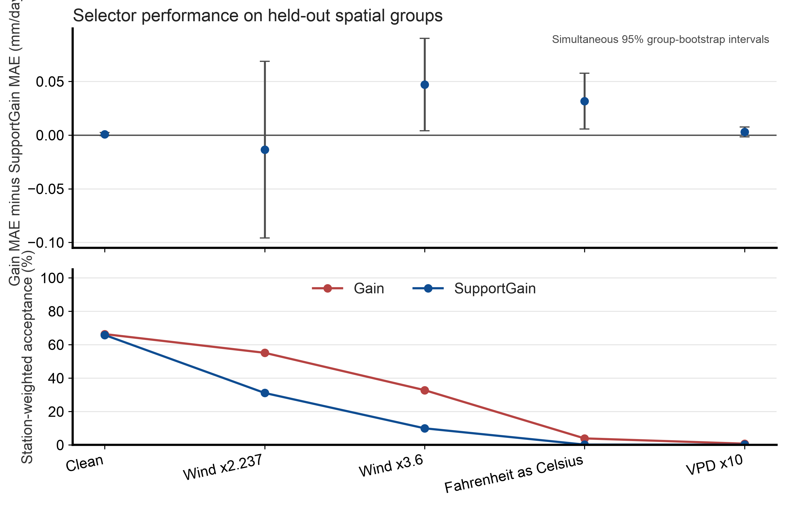

# Spatial holdout audit, first fold

Status: exploratory. This single split was selected after the archive outcomes were visible.

## Design

The test set has 2,639 rows from 24 stations and 21 spatial groups.
No test station or group appears in training.
The network has ten neural members.
The fit uses three inner spatial folds.
The training data includes all years from the other groups.
This tests spatial transfer, not forecasting or independent replication.

The outcome is Gain station-macro MAE minus SupportGain station-macro MAE.
Positive values favor SupportGain.
The interval uses 2,000 group-bootstrap draws with seed 20261060.
The simultaneous interval covers the five fixed conditions.
It conditions on the fitted models.
No p-value was calculated.

## Results

| Test input | Gain minus SupportGain MAE, mm/day | Simultaneous 95% interval, mm/day | Gain acceptance | SupportGain acceptance |
| --- | ---: | ---: | ---: | ---: |
| Clean | 0.0009 | [-0.0005, 0.0023] | 66.3% | 65.8% |
| Wind x2.237 | -0.0135 | [-0.0957, 0.0686] | 55.1% | 31.1% |
| Wind x3.6 | 0.0471 | [0.0041, 0.0900] | 32.8% | 10.0% |
| Fahrenheit read as Celsius | 0.0316 | [0.0057, 0.0576] | 3.9% | 0.21% |
| VPD x10 | 0.0029 | [-0.0016, 0.0075] | 0.76% | 0.18% |

The clean interval includes zero.
Wind multiplied by 2.237 and VPD multiplied by ten also have intervals that include zero.
The two positive intervals come from one selected group split.
Treat them as exploratory.

## Records

- Protocol: [spatial holdout](../../evaluation/ML_TIER1_SPATIAL_HOLDOUT_PROTOCOL.md)
- Results: results.json
- Group effects: group_deltas.csv
- Row predictions: predictions_*.csv
- Split assignments: splits.json
- Run and analysis receipts: run_receipt.json, analysis_receipt.json
