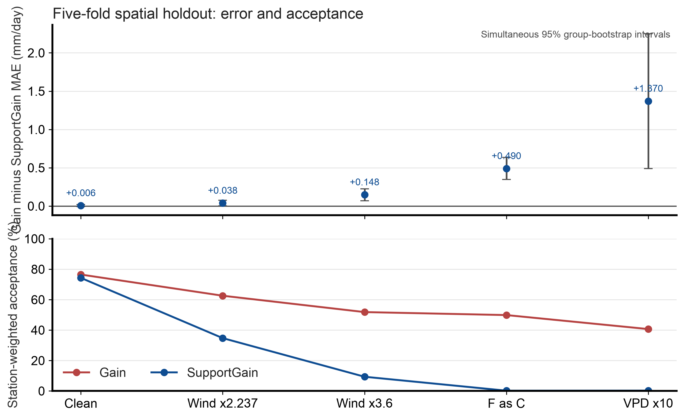

# Spatial holdout sensitivity

Status: post hoc and exploratory. The method choices and archive outcomes were visible before this analysis.

## Design

The run uses five group folds from the screened gridMET cohort.
Each spatial group serves as test data once.
The fit for each fold excludes every row and station from its test groups.
The pooled prediction set has 16,366 rows, 151 stations, and 102 groups.
This tests spatial transfer within this archive.
It does not test forecasting or transfer to an independent dataset.

The primary outcome is Gain station-macro MAE minus SupportGain station-macro MAE.
Positive values favor SupportGain.
The protocol fixes five conditions and uses station-weighted acceptance.
The intervals resample spatial groups for 2,000 draws with seed 20261060.
The intervals are simultaneous across five conditions.
They condition on fitted models and do not include retraining uncertainty.
The analysis reports no p-values.

## Results

| Test input | Gain minus SupportGain MAE, mm/day | Simultaneous 95% interval, mm/day | Gain acceptance | SupportGain acceptance |
| --- | ---: | ---: | ---: | ---: |
| Clean | 0.0059 | [-0.0069, 0.0186] | 76.5% | 74.3% |
| Wind x2.237 | 0.0384 | [0.0015, 0.0752] | 62.6% | 34.7% |
| Wind x3.6 | 0.1478 | [0.0697, 0.2260] | 51.8% | 9.3% |
| Fahrenheit read as Celsius | 0.4899 | [0.3454, 0.6344] | 49.9% | 0.18% |
| VPD x10 | 1.3698 | [0.4886, 2.2511] | 40.7% | 0.22% |

The clean interval includes zero.
Each interval for a fixed unit transform is positive.
SupportGain accepts fewer rows under every transform.
Its large error reductions under the Fahrenheit and VPD transforms coincide with acceptance below 0.3%.
The result therefore shows a coverage and error tradeoff.
It does not show that the neural correction stays accurate on corrupted inputs.
The transforms do not estimate natural fault prevalence.

Positive values in the upper panel favor SupportGain.
The lower panel shows the station-weighted share of accepted corrections.
F as C means Fahrenheit values are read as Celsius.

## Compute record

The five-fold extension took 108.8 seconds for four new folds and 160 neural members.
This is one run with no timing interval.
The earlier one-fold run took 28.2 seconds for 40 neural members, also one run.
Both runs used macOS 26.6.2 ARM64, Python 3.13.5, NumPy 2.4.3, pandas 2.3.3, and scikit-learn 1.8.0.
The two workloads differ, so do not treat these times as a speed comparison.
Paid compute cost was $0; electricity cost was not measured.

## Records

- Protocol: [five-fold sensitivity](../../evaluation/ML_TIER1_SPATIAL_HOLDOUT_SENSITIVITY.md)
- Original fold-zero protocol: [spatial holdout](../../evaluation/ML_TIER1_SPATIAL_HOLDOUT_PROTOCOL.md)
- Results: results.json
- Group effects: group_deltas.csv
- Row predictions: predictions_*.csv
- Fold assignments: splits.json
- Run and analysis receipts: run_receipt.json, analysis_receipt.json
- Figure receipt: figure_receipt.json
- Figure PDF: [Figure 23](../../../manuscript/arxiv/figures/figure_23_tier1_spatial_holdout_sensitivity.pdf)
- Figure builder: scripts/build_ml_tier1_spatial_holdout_figure.py

The figure adapts the typography, palette, minimal spines, annotations, and vector export guidance in the [figures4papers workflow](https://github.com/ChenLiu-1996/figures4papers/blob/main/scientific-figure-making/SKILL.md).
