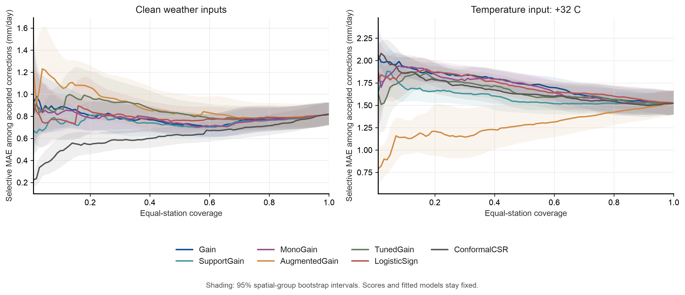

# Tier 3 risk-coverage results

This analysis follows the frozen [risk-coverage protocol](../../evaluation/ML_TIER3_RISK_COVERAGE_PROTOCOL.md). It uses saved Tier 3 predictions and does not fit a new outer model.

The protocol was committed before analysis in commit `49f25a1`. Its SHA-256 hash is `1ae4743a187894307b9f80a2ac4b639521469d69a7f86298edc70c30cdafd3f5`.

## Evaluation

The analysis covers nine test years from 2012 through 2020. It uses 7,842 rows from 101 stations and 64 proximity groups. It evaluates 13 weather conditions and seven selectors.

Each row receives inverse station-count weight. Coverage is the weighted share of accepted rows. Selective risk is the weighted MAE of `OpenET + correction` among accepted rows. The curve uses 100 coverage levels from 1% to 100%. It accepts a fractional share of tied scores at the boundary. AURC is the mean risk across those levels, in mm/day.

The fixed operating point uses each saved gate. The summary also reports conditional MAE and end-to-end MAE with the saved OpenET fallback. These metrics answer different questions.

SupportGain uses the minimum of its standardized benefit and support margins. The analysis rebuilt its inner score scales from the saved splits. Its confidence score matched the saved gate in all 13 conditions. The check found zero mismatches.

## AURC

Lower values describe lower conditional error across the tested coverage levels. The intervals use 2,000 spatial-group bootstrap draws. They condition on the fitted models and scores.

| Selector | Clean AURC, 95% interval | Temperature +32 C AURC, 95% interval |
| --- | ---: | ---: |
| Gain | 0.786 [0.679, 0.903] | 1.733 [1.623, 1.837] |
| SupportGain | 0.750 [0.643, 0.865] | 1.588 [1.479, 1.707] |
| MonoGain | 0.778 [0.678, 0.885] | 1.704 [1.582, 1.819] |
| AugmentedGain | 0.894 [0.747, 1.061] | 1.278 [1.103, 1.482] |
| TunedGain | 0.847 [0.733, 0.970] | 1.651 [1.507, 1.794] |
| LogisticSign | 0.789 [0.673, 0.931] | 1.711 [1.599, 1.827] |
| ConformalCSR | 0.624 [0.548, 0.702] | 1.663 [1.541, 1.791] |

ConformalCSR has the lowest clean point AURC. The intervals overlap. The protocol specifies no pairwise superiority test.

AugmentedGain has the lowest point AURC under the temperature-plus-32 C transform. Its fixed gate accepts 11 of 7,842 rows. Its station-weighted coverage is 0.11%. SupportGain accepts no rows in this condition. Its end-to-end station-macro MAE is 0.854 mm/day because it returns OpenET.

The fault-condition curves rank hypothetical thresholds across the full coverage range. They do not change the saved operating thresholds. Read them with the fixed gate results in [fixed operating points](fixed_operating_points.csv).

## Limits and records

Each interval resamples the 64 proximity groups and keeps each group's rows together. It does not include model refitting or threshold-selection uncertainty. Conditions and selectors share the same observations. The analysis reports no p-values.

All 270 reconstructed inner neural members reach 120 iterations and report a convergence warning. This may limit the score-scale estimates.

The first un-cached score reconstruction and analysis took 159.0 seconds. A cached rerun took 14.0 seconds. Both are single runs. No timing interval was measured. The run used Python 3.13.5, NumPy 2.4.3, pandas 2.3.3, and scikit-learn 1.8.0.



Figure 17 shows clean inputs and the temperature-plus-32 C transform. Shading shows 95% spatial-group bootstrap intervals. Model scores and fits stay fixed.

The figure follows the layout, typography, palette, and vector-export approach in the [figures4papers repository](https://github.com/ChenLiu-1996/figures4papers). The repository describes its scientific figure workflow as publication-ready Matplotlib work. See the [workflow instructions](https://github.com/ChenLiu-1996/figures4papers/blob/main/scientific-figure-making/SKILL.md).

## Files

- [All 9,100 risk-coverage points](risk_coverage_curves.csv)
- [AURC and bootstrap intervals for all 91 condition-selector pairs](aurc_summary.csv)
- [Fixed gates, conditional MAE, and fallback MAE](fixed_operating_points.csv)
- [SupportGain score check](support_score_check.csv)
- [Analysis receipt](analysis_receipt.json)
- [Figure receipt](figure_receipt.json)
- [Protocol](../../evaluation/ML_TIER3_RISK_COVERAGE_PROTOCOL.md)
- [Figure 17 PDF](../../../manuscript/arxiv/figures/figure_17_tier3_risk_coverage.pdf)

Reproduce the analysis and figure with:

```sh
python3 scripts/analyze_ml_tier3_gridmet_risk_coverage.py
python3 scripts/build_ml_tier3_gridmet_risk_coverage_figure.py
```

The analyzer verifies the input hashes. It rebuilds SupportGain scales when its source hashes or software versions change.
